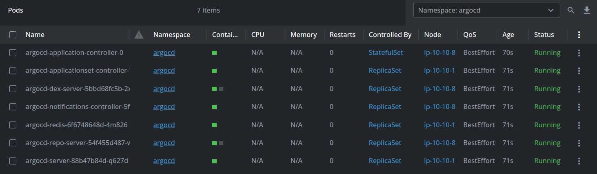

# 🔰 Introduction 🔰

* This folder contains `Terraform` configuration used in the ***[Argo CD article](link)*** about local users management.

# 🧰 Prerequisites 🧰

* The following is required :

  * `AWS` account;

  * `Terraform` (version `1.3.2` or higher);

  * `kubectl` (we used version `1.31.0`);

  * `Git` (we used version `2.34.1`);

  * `AWS CLI` (we used version `2.17.32`).

* Described setup is required only if you’d like to reproduce steps from this configuration. Your `Kubernetes` cluster can be provisioned anywhere.

> [!CAUTION]
> This setup isn’t included in the `AWS Free Tier`.

# 🛩️ Usage guide 🛩️

* We are going to create two users : one with `readonly` access to all possible resources, including `applications` sync, and one with `full` access only to `projects`. 

* `Argo CD` expects the password in the secret to be `bcrypt` hashed. You can create this hash with the following commands :

```
# readonly user (alice)
ARGO_PWD="a-e~X's,LeOTWvGcQ<P!"
htpasswd -nbBC 10 "" $ARGO_PWD | tr -d ':\n' | sed 's/$2y/$2a/'

# Output
$2a$10$wd7CL1OZnpRy9UwLtGaa8OPfMHQsg3yJl0VUe0MSG6mP.bNDoJ2b6

# projectmanager user (bob)
ARGO_PWD="P-Zw]'rI5-psOzoM%TV&"
htpasswd -nbBC 10 "" $ARGO_PWD | tr -d ':\n' | sed 's/$2y/$2a/'

# Output
$2a$10$l.mdQVUMOhSCYILKt.GEkeILGmRVoAQANikq1NXGr6vAbH5290aey
```

* To securely pass passwords we will leverage `AWS Secrets Manager`. For `Secret type` select `Other type of secret`. Fill in `Key/value` pairs. Name the secret. As a result, you will have the following (name keys as you wish) :


* Clone the `GitHub` repository :

```
git clone https://github.com/dedicatted/devops-tech.git
```

* Navigate to `devops-tech/argocd/Manage-users-without-cli-access` folder.

* Look through variables inside `variables.tf` and change values according to your desired configuration. For example, you could give another name to `Secrets Manager` secret keys. In this case, adjust the value for the `secrets_manager_secret_keys` variable and set the same key names inside `secrets_manager.tf` file. Also, pay attention to the `secrets_manager_secret_name` variable.

* For simplicity, we are not using the remote state. You can add this to the configuration if needed.

* Run the following commands to provision infrastructure :

```
terraform init
terraform plan
terraform apply
```

* Wait for infrastructure to be created. This takes some time.

* Add `EKS` cluster to `kubeconfig` (adjust inputs if needed) :

```
aws eks update-kubeconfig --region eu-central-1 --name my-eks-for-argocd-tutorial
```

* `Argo CD` was successfully installed :



* `port-forward` `argocd-server` service : 

```
kubectl port-forward svc/argocd-server -n argocd 8085:443
```

* Navigate to `https://localhost:8085` to access `Argo CD` UI.

* From this step, follow the ***[article](link)*** to understand the applied `Argo CD` configuration and how to work with it.

# 🧹 Cleanup 🧹

* Stop `port-forwarding` : `Ctrl+C` in a terminal window where the process is running.

* Remove `Terraform` resources : 

```
terraform destroy
```

* Delete `AWS Secrets Manager` secret.

# 🛠️ Maintainers 🛠️

* **[plain5](https://github.com/plain5)**
