# Keycloak Integration with AWS OpenSearch

## Introduction
One of our dedicated clients came to us with a problem related to integrating Keycloak as an IdP (Identity Provider) using the SAML protocol with the AWS OpenSearch Managed service. Since their tech team had not been able to find a resolution so far, we decided to assist them by diving into the situation to develop an implementation strategy.
They are planning to migrate from a legacy OpenSearch deployment to the AWS cloud, using the latest available services and features.

## Input Data
- Deployed Keycloak v15.0.2 on a client's EC2 Instance with Docker-compose
- AWS OpenSearch v1.3

## Let's Start!
### General AWS OpenSearch Initialization & Configuration
1. Deploy your AWS OpenSearch cluster as you wish (manually, using Terraform, CloudFormation, etc.). We will skip the deployment part and focus solely on the necessary configuration steps to successfully complete our mission.
2. Enable SAML Authentication and obtain the Service Provider Entity ID:
   - Navigate to AWS OpenSearch -> Security configuration -> Enable SAML Authentication
   - After confirming the operation, preserve the Service Provider Entity ID, as it will be needed later in the process.

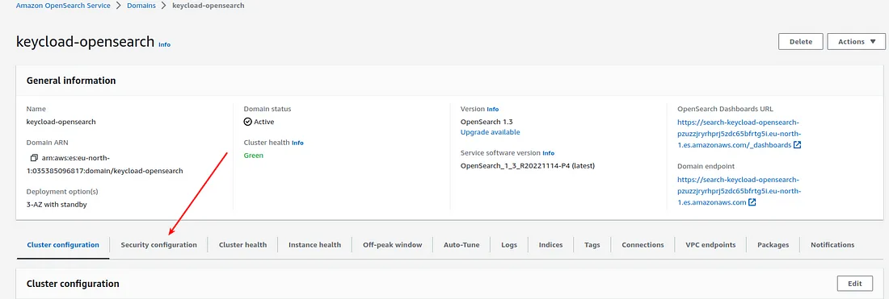

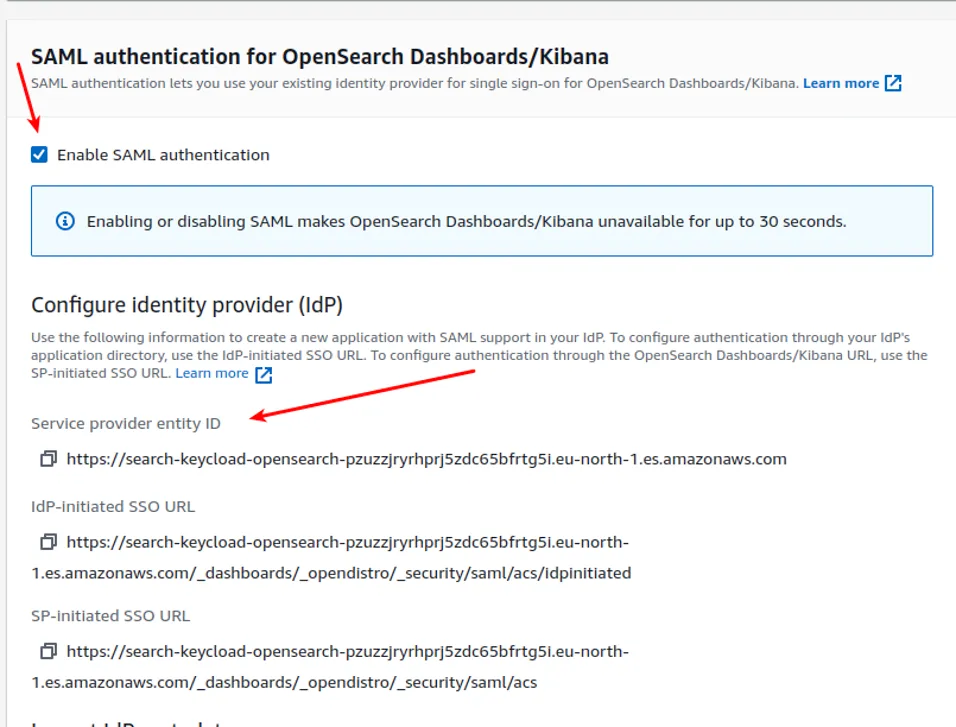

### Keycloak Configuration
1. Go to "Clients" -> "Add Client".
2. Set your Client ID (choose any name) and select the Client Protocol (SAML).

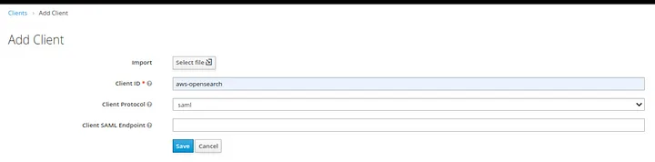

3. Complete the client configuration form with the following details:
   - **Client ID** – Must match the Service Provider ID from AWS OpenSearch (required)
   - **Name** – Custom name
   - **Client Protocol** – SAML (required)
   - **Enabled** – Set to "On" (required)
   - **Include Authn Statement** – Set to "On" (required)
   - **Sign Documents** – Set to "On" (required)
   - **Sign Assertions** – Set to "Off" (required)
   - **Encrypt Assertions** – Set to "Off" (required)
   - **Client Signature Required** – Set to "Off" (required)
   - **Force POST Binding** – Set to "Off" (required)
   - **Front Channel Logout** – Set to "Off" (required)
   - **Force Name ID Format** – Set to "Off" (required)
   - **Name ID Format** – "username" (required)
   - **Valid Redirect URIs** – AWS OpenSearch URL with '/*' at the end (required)
     Example: `https://vpc-mcg-opensearch-vlttyu4wuikcr2jrrfvr4lzmi4.eu-central-1.es.amazonaws.com/*`
   - **Base URL** – Realm endpoint `/auth/realms/test/protocol/saml/clients/osd` (required)
   - **IdP Initiated SSO URL Name** – Keycloak client name (required)
   - **IdP Initiated SSO Relay State** – SSO URL (IdP initiated); OpenSearch v1.3 requires a value change from `_opendistro` to `_plugins` (required)
   - **Assertion Consumer Service POST Binding URL** – OpenSearch v1.3 requires a value change from `_opendistro` to `_plugins` (required)
   - **Logout Service Redirect Binding URL** – OpenSearch v1.3 requires a value change from `_opendistro` to `_plugins` (required)

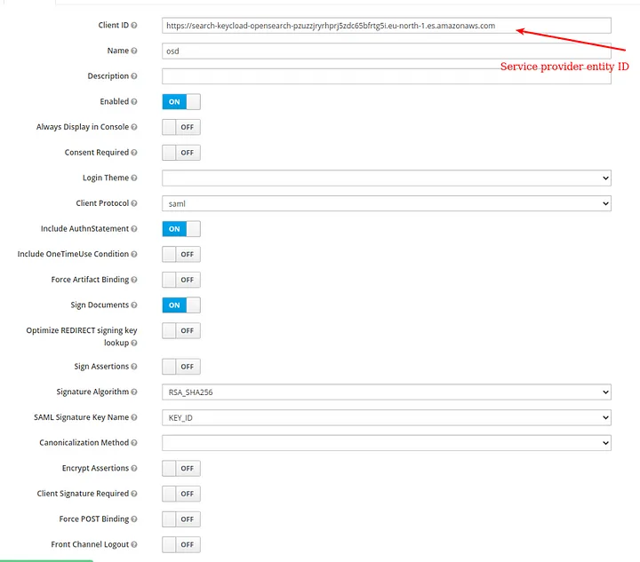


4. Create a new role `default-role-test` and configure it:
   - Choose "Client Scope" -> Unassign the "role_list" role from the client
5. Create Protocol Mapper:
   - **Scopes** – Full Scope Allowed: "On"
   - Save the configuration
6. Go to "Users":
   - Create a user and set a password
7. Go to "Role Mappings" and select your user:
   - Unassign `default-role-test` and assign your client role, then click "Select a client" and choose your Client ID.

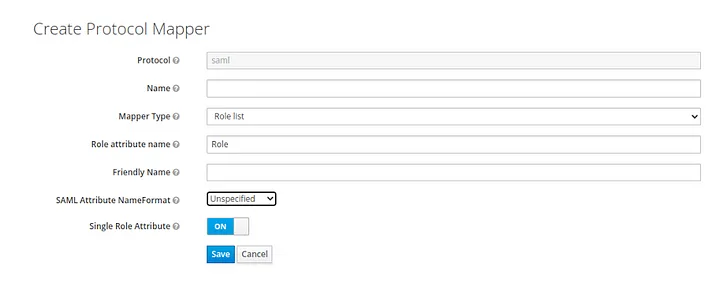

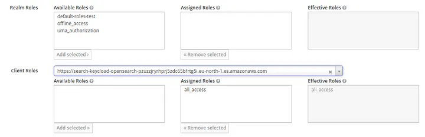

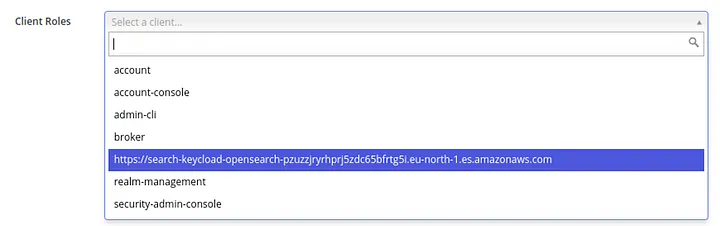

## AWS OpenSearch Integration with Keycloak
1. Import Realm Metadata to AWS OpenSearch:
   - Navigate to "Realm Settings", then "SAML 2.0 Identity Provider Metadata"

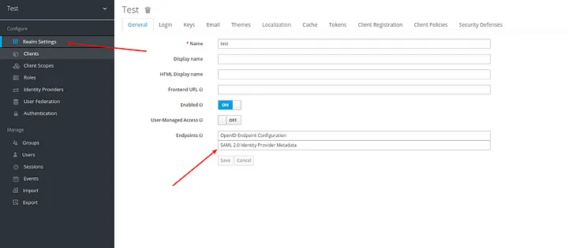

  - Click to redirect to the metadata page, copy this data, and paste it into the "Metadata from IdP" field in the AWS OpenSearch Security Configuration tab

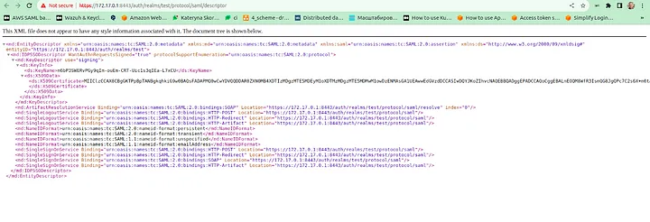

  - The IdP Entity ID will be automatically read from the IdP metadata

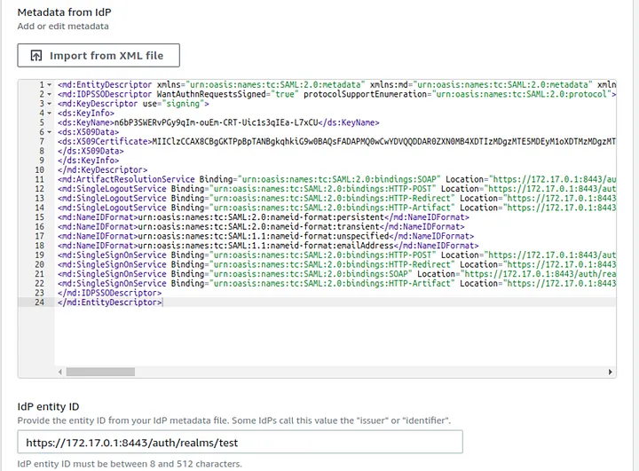

2. Role & User Configuration

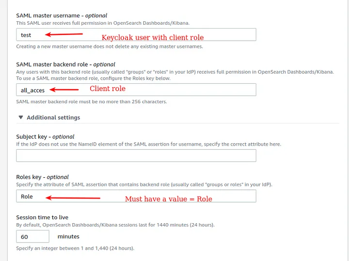

3. Final Result:
   - Mapped Keycloak user and roles

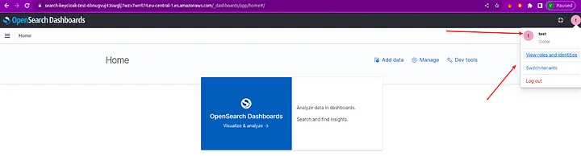

Congratulations! You can now manage the authentication of your users to AWS OpenSearch via Keycloak.

## Additional Tips
Remember, if you want to restore your OpenSearch snapshot on a new instance (as we did), don't forget to exclude default indexes to avoid a restoration error.

Here's an example `snapshot-restore.py` script (this only works if you have registered an S3 repository):
```python
import boto3
import requests
from requests_aws4auth import AWS4Auth

host = 'https://localhost:9200/'  # Your Elasticsearch host address
region = 'eu-central-1'  # e.g., us-west-1
service = 'es'
credentials = boto3.Session().get_credentials()
awsauth = AWS4Auth(credentials.access_key, credentials.secret_key, region, service, session_token=credentials.token)

path = '_snapshot/s3-snapshot-repo/2023–01–21_snapshot/_restore'
url = host + path
payload = {
    "indices": "-.kibana*,-.opendistro_security",
    "include_global_state": False
}
headers = {"Content-Type": "application/json"}
r = requests.post(url, auth=awsauth, json=payload, headers=headers)
print(r.text)
```

## Conclusion
This is how we successfully developed a method to integrate Keycloak into the AWS OpenSearch Cluster. Unfortunately, no guides were available for the latest versions of OpenSearch and Keycloak, prompting us to share our findings with the community.

### Authors:
- Vladyslav Hlushchenko
- George Levytskyy

### Links
[Dedicated Site](https://dedicatted.com/) | [LinkedIn](https://www.linkedin.com/company/ddcttd/) | We are continuously hiring [Junior](https://jobs.dou.ua/companies/dedicatted/vacancies/240562/) and [Middle](https://jobs.dou.ua/companies/dedicatted/vacancies/240560/) DevOps Engineers