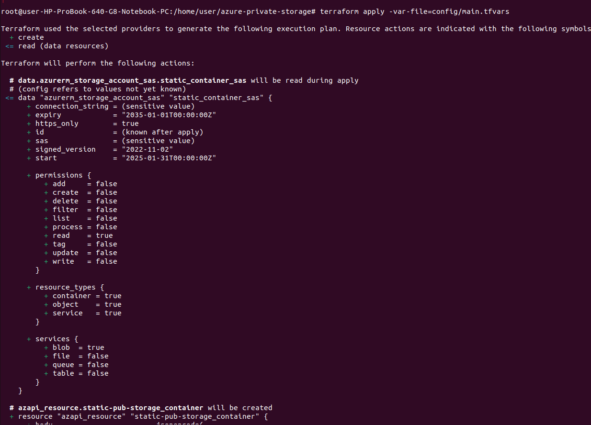
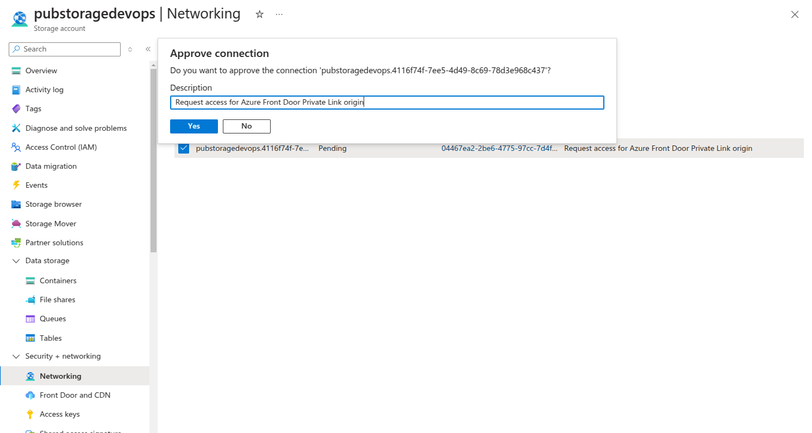
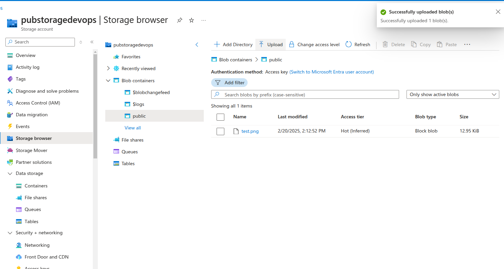
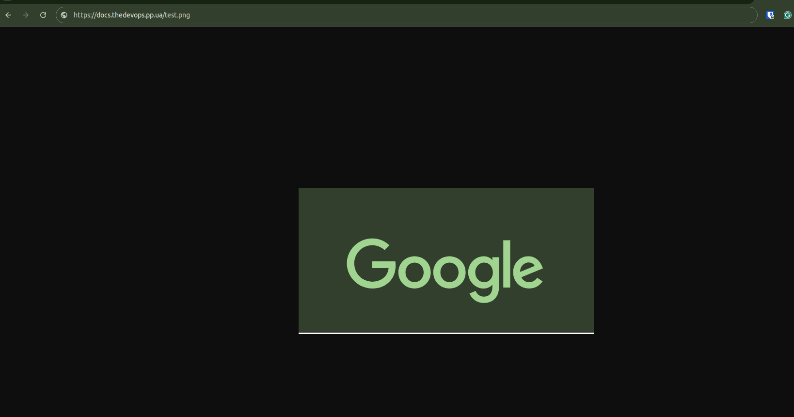

## Azure private Blob Storage Account setup public access with Front Door for HITRUST certification using Terraform - Step-by-Step Guide

#### Quick start:
> [!TIP]  
>Detailed article read on [Medium](Set_link_here)

Before starting you need to edit `./config/main.tfvars.example` and rename it to `./config/main.tfvars` Just follow the comments inside the file.


> [!NOTE]  
> At next `az` commands you need to set your data in place `<>`

#### Logging to Azure:

```
az login --username <Bohdan.Boiko@dedicatted.com>
az account set --subscription <11223344-1111-2222-3333-c55a52cfbe4c>
```

#### Initialize Terraform:

```
terraform init
terraform plan -var-file=config/main.tfvars
```


#### Apply Terraform Configuration:

```
terraform apply -var-file=config/main.tfvars
```


#### Action after apply:
You need to manually approve the Private Endpoint in the Network settings of the Storage account



Then you can upload a file to storage: 



It will successfully work with your domain:


#### Additional Links:

- [How to import DNS zone to Azure](https://learn.microsoft.com/en-us/azure/dns/dns-delegate-domain-azure-dns)